# Documentación del Proyecto ERP

### Información General: 
- Este proyecto esta creado con un ERP, llamado Odoo. El cuál hemos utilizado para desarrollar la aplicación web. El programa esta diseñado tanto para la venta de productos de temporada de esquí, como de artículos de alta montaña.

### Nombre del Proyecto: 
- CrystalPeak

### Product Manager: 
- Guillermo Jaume Murciano

### Equipo de Desarrollo:  
- Felipe Gonzales
- Mustapha Bouleili

### Objetivos del Proyecto
-  El objectivo de este proyecto es desarrollar una aplicación web que sea fácil de usar, tanto para el cliente, como para el empleado. 
- Control del stock variado para asegurar satisfacer las necesidades de los clientes.
- Sistema que registra los alquileres, las compras, el mantenimiento, clientes, trabajadores.
- Página web en la que se gestionan las compras online y el transporte.

### Wireframe de las diferentes vistas
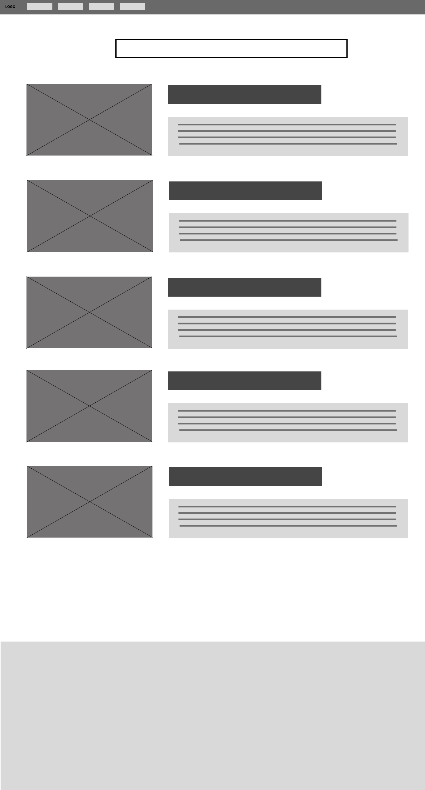
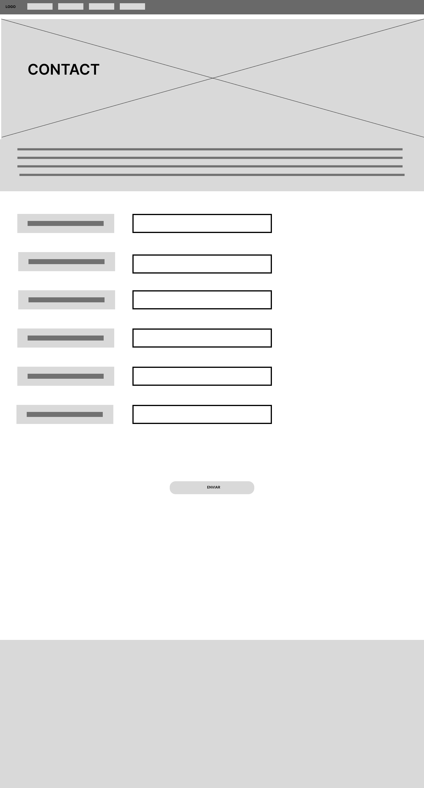
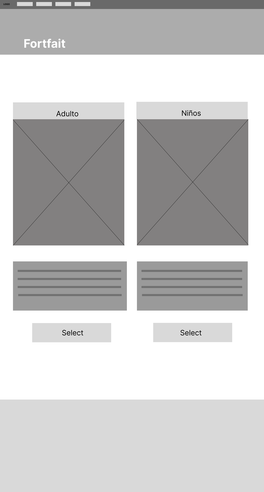
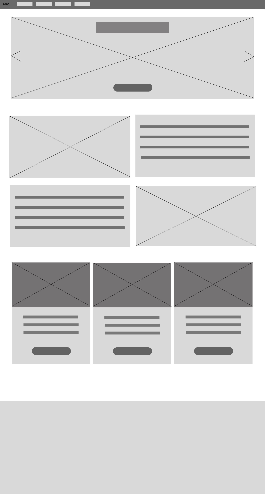
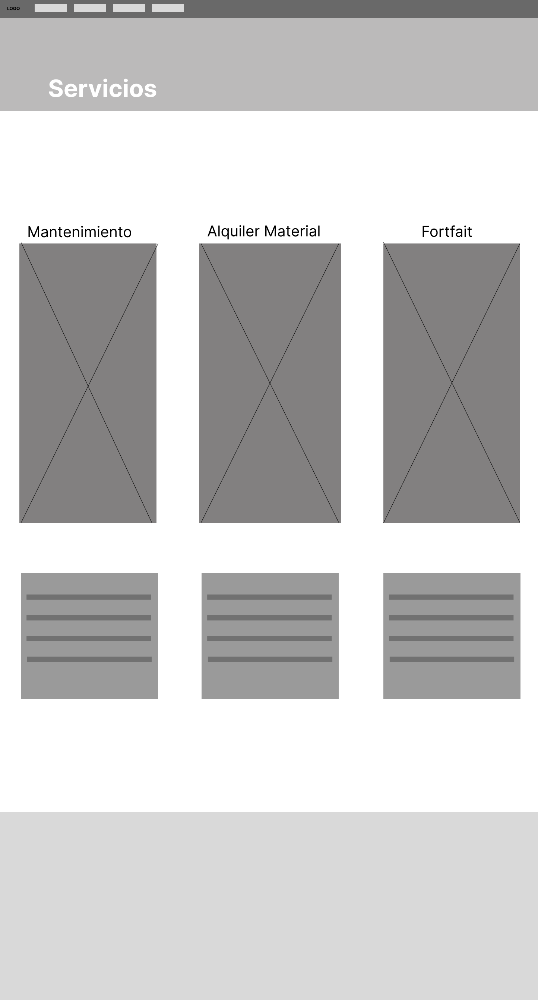

### MockUps de los Wireframes
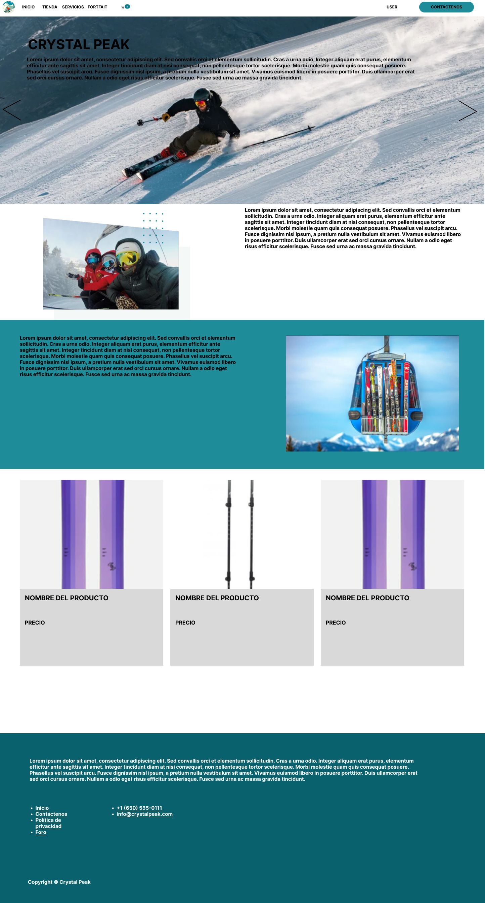
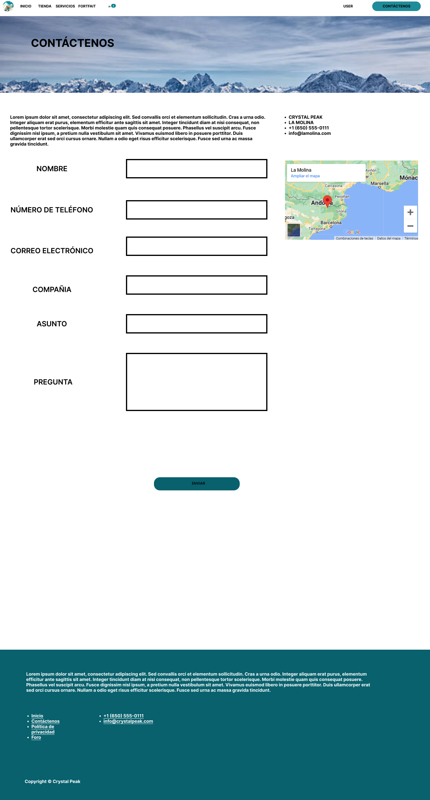
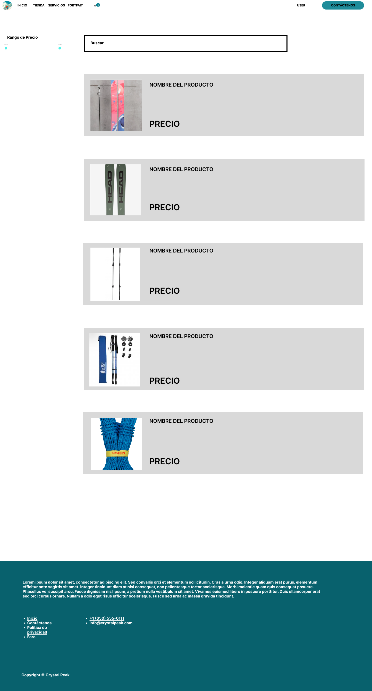
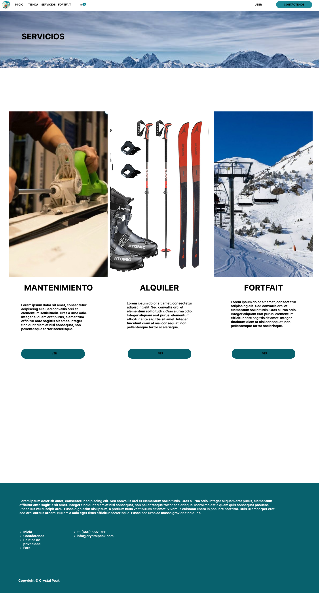
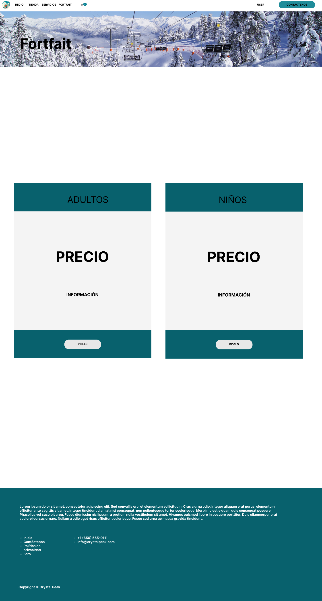

Presione el [enlace](https://www.figma.com/file/vtHUXnUfiE0da9cD33XcGW/Wireframe?type=design&node-id=0%3A1&mode=design&t=vX1iOBV84rtKPEGO-1) para ver los Wireframes y Mockups.

### Capturas semanales Kanban
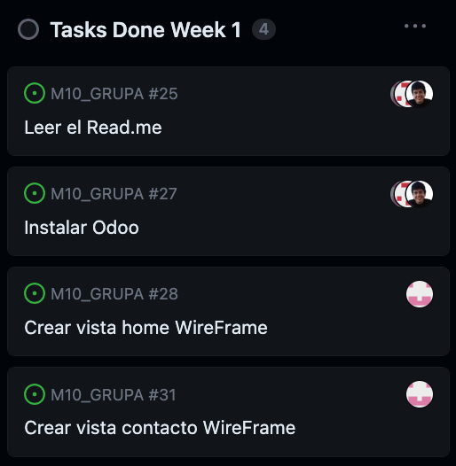
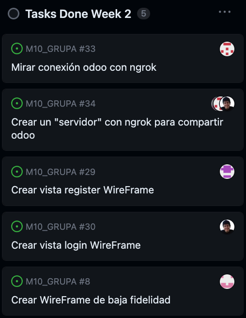
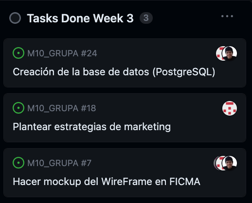
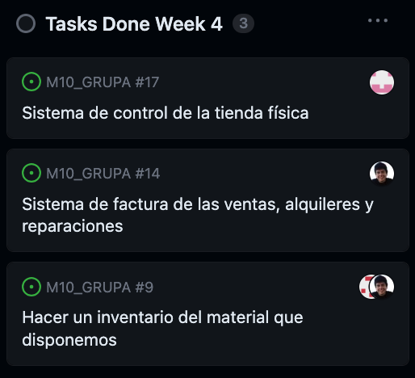
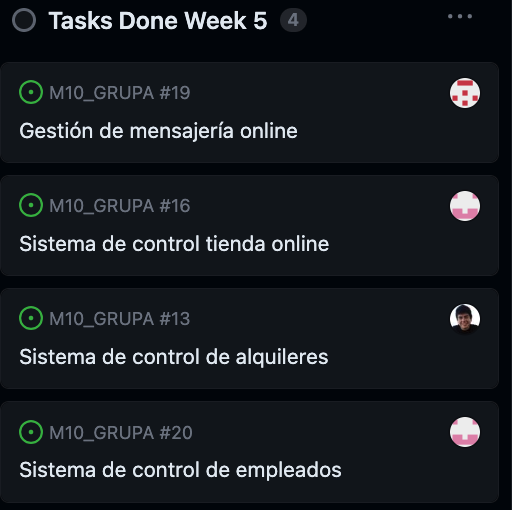
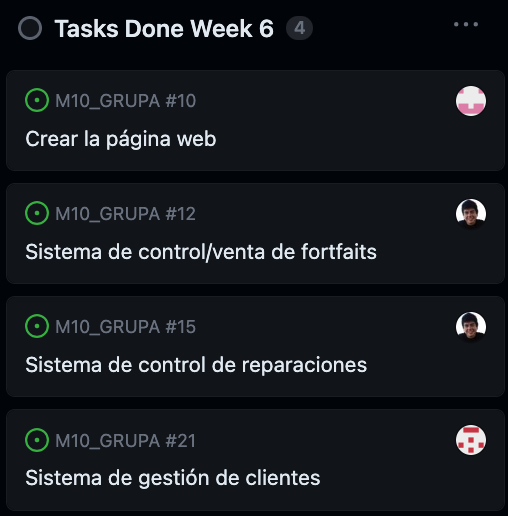

### Funcionalidades del proyecto:
- #### Creación de empleados CRM (Customer Relationship Management) Seguimiento de clientes potenciales.
    - Este módulo nos permite un control sobre los clientes.
- #### Creación de facturas.
    - Este módulo nos permite crear faturas tanto de la compra/venta de material como de los diferentes servicios dentro de la empresa.
- #### Estoc de inventario.
    - Nos permite tener un control absoluto de todos los productos de los que disponemos dentro de la tienda.
- #### Administración de servicios.
    - Nos permite administrar y almacenar nuestros servicios.
- #### Venta online.
    - Nos permite la venta de material, ya sea de esquí como de alta montaña, de forma online.
- #### Servicio de solución de problemas. 
    - Permite a los clientes estar en contacto con la empresa para solucionar cualquier duda o problema que puedan llegar a tener.

### Modelo de Datos:
- Base de datos PostgresSQL.

## Instrucciones para solucionar problemas
###  Documentación para el Usuario
- En la página web hay un apartado en la parte superior central, dónde se encuentra un botón el cuál abrirá una vista/pestaña nueva en la que se podrá enviar un mensaje para solucionar cualquier tipo de duda con la empresa. En dicho botón pone "Contáctenos". Lo único que necesitaremos será introducir algunos datos para la respuesta por parte de los empleados.